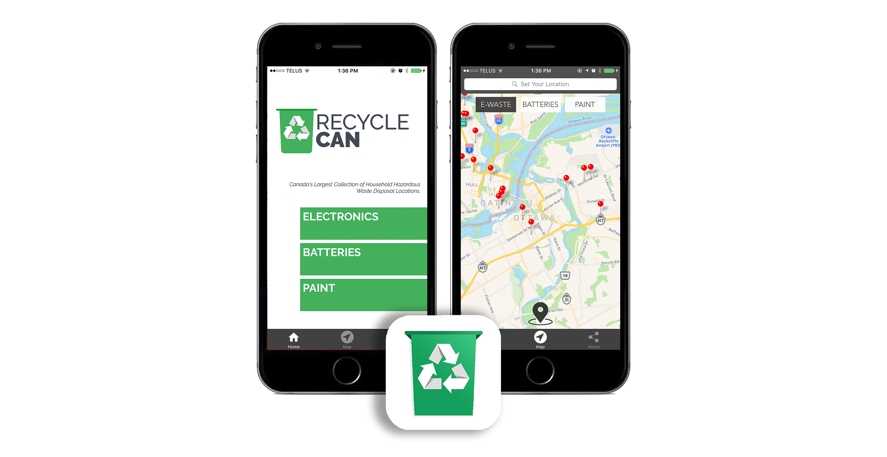
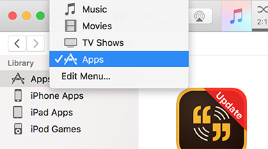
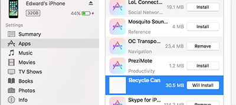
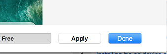
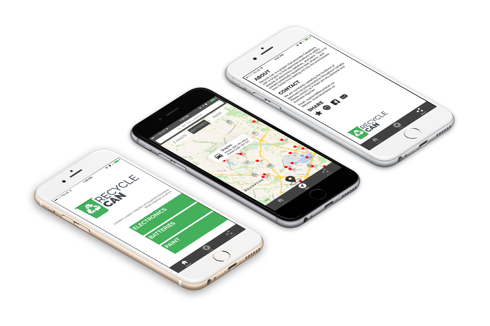

<p align="center">


</p>

# Recycle Can iOS

Recycle Can is an iOS application that facilitates recycling of electronics, batteries, and paint for Canadians. Making use of Mapkit and geocoding, Recycle Can provides both a navigational toolset as well as a massive database to help users recycle their electronic waste. This is the iOS version with the full and much more functionality of the Recycle Can website. To run the application, it can be found on the iOS app store. Otherwise, manual installation can be done through this repository with a few simple steps

Recycle Can can be found on the Appstore [here](https://itunes.apple.com/us/app/recycle-can/id1248915926?ls=1&mt=8)

Recycle Can has been featured on multiple news outlets such as

<p align="center">
<br/>
</p>

<p align="center">
<a href = "http://www.metronews.ca/news/ottawa/2017/08/30/ottawa-student-s-recycling-app-a-success.html">Metro News</a>

</p>

<p align="center">
<br/>
</p>

<p align="center">
<a href = "http://www.canewsottawa.ca/single-post/2017/08/28/Ottawa-Teen-Takes-on-the-Toxic-Problem-of-Electronic-Waste">CA News Ottawa</a>


</p>

<p align="center">
<br/>
</p>

<p align="center">
<a href = "http://www.ottawatechwatch.com/story.php?title=recycle-can">Ottawa TechWatch</a>

</p>


# Links

1. [Requirements](#requirements)
2. [Setup](#setup)
* [Download](#download)
* [Installation](#installation)
3. [Features](#features)<br />
* [Navigation Routes](#navigation-routes)
* [Toolbar](#toolbar)<br />
4. [Database Files](#database-files)
5. [Collection](#collection)
* [Database Sources](#database-sources)
* [XHR Network Responses](#xhr-network-responses)
* [Alberta Township System](#alberta-township-system)<br/>
5. [License](#license)
6. [Contact](#contact)


# Requirements
Recycle Can will work with any iOS device running iOS 9.0 or above. It is highly recommended for users to enable location services in-app to facilitate our navigational tools. Otherwise, the application is still fully functional but lacks features such as automatic routing from the current location to a desired destination. Without location services, the default location is set at Ottawa, Ontario.

# Setup
Recycle Can can be installed manually or on the app store. The way to manually install this iOS application is detailed below

## Download
It is recommended to download Recycle Can directly from the App Store, however, it can still be downloaded manually. Find the Recycle_Can.ipa file in the main directory and download it. This can be done by doing

```
$ git clone https://github.com/EdwaRen/Recycle_Can_iOS
```
The Recycle_Can.ipa file is the only important file needed for installation, the rest are production files that contain the open sourced code.

## Installation
This installation works for iTunes 12.x
Drag the .ipa file into the apps section of your iTunes Library, as seen below



Now connect your device in iTunes, select your device, and go to the 'apps' tab. There, scroll down to the Recycle Can app and click 'Install'. This will change the button to 'Will Install'



Finally, hit the 'Apply' button below to apply this installation.




# Features


## Navigation Routes
Recycle Can provides tools to help navigate to the nearest recycling location. By detecting your location and comparing it with a massive database of recycling centers, Recycle Can calculates the optimal location for your specific needs. Furthermore, the most efficient route to the destination is also plotted in-app that can be followed in real-time. This functionality makes it unnecessary to exit the app, as previous versions would open up Apple's 'Maps' application to plot the route there.

The closest recycling locations are automatically displayed on the screen. Plotting a route can be simply achieved by clicking on a location (marked by a pin) and clicking the car button to the left of the popup annotation view. On the bottom right of the screen, additional information such as distance to that location is also shown.

## Toolbar
A toolbar at the bottom of the screen provides helpful buttons to optimize the user experience. These include zooming to the original location, deselecting routes, or showing a minimalist screen with less buttons.

# Database Files
The databases (in MS Excel) has been linked below. Since the file size is 'relatively' small, it has been decided to simply store it locally rather than a server-side database. This is to avoid potential complications with server down-times and the fact that recycling locations are rather static which do not need constant updates. All the locations have been found in publicly available sources. If there are any inconsistencies or missing locations, please feel free to contact us to express these concerns.

https://drive.google.com/open?id=0B-e2EwA68EQgNnB2cWxOcWp3cjQ

# Collection

## Database sources
Information was procured from many sources, including municipal and provincial webpages. A major hurdle in this approach was that many provinces did not provide a list of electronic recycling centers available publicly online. Hence some third party sites were also used.

## XHR Network Responses
Originally designed to be an municipal recycling app for Ottawa, the latitude and longitude locations of the recycling centers were originally manually translated one by one from their postal codes. However, this tactic was soon outdated as the situational objective changed to facilitate the broader goal of creating a nationwide recycling application where it would be too time consuming to manually translate postal codes into coordinates.

To further this issue, much of the recycling locations were found on websites without a single source of all database information. In fact, most webpages simply offered a Google Maps widget with locations dotted around the map without any source for latitude/longitude information necessary to create our own database with these locations. Hence, the necessary coordinate locations needed to be obtained by monitoring all location pin requests from the map widget.

The returned information was monitored using XHR network requests on Firefox where the entire response could be downloaded. These responses often came with much unnecessary metadata and character encoding issues (Merci Québec). Hence a multitude of filters, formulas, and VBA scripts were applied in Excel to return the relevant information.

## Alberta Township System
Alberta was a very unique province that provided an intriguing challenge in tackling the issue of electronic recycling locations. Official approved recycling locations by a webpage associated with the provincial government gave coordinates in the format of the Alberta Township System (ATS). The process to convert these locations into latitude longitude coordinates was difficult because of the low level worldwide usage of the ATS address format. Even major mapping software such as Google Maps or Apple Maps did not recognize these coordinates. However, there did exist software which allowed manual conversion of ATS addresses into latitude/longitude coordinates, albeit it was a lengthy process. The workaround chosen to make this process faster was to write a script to automate this  mechanism that would inject custom JavaScript into a webpage and loop through the ATS coordinates while recording the returned longitude/latitude coordinates.

# License
Copyright Edward Ren 2017
MIT License see [LICENSE](../blob/master/LICENSE)

# Contact
If you have any questions or inquiries concerning Recycle Can or suggestions for future releases, send an email to Edward.ren.2013@gmail.com
